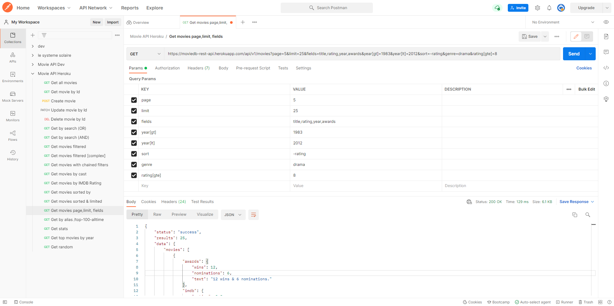

# MovieDB Rest Api
> A NodeJS Rest Api utilizing a MongoDB Cloud Atlas database with ~ 23.5k documents.
> Live demo [_here_](https://moviedb-rest-api.herokuapp.com/api/v1/movies). 

## Table of Contents
- 
  - [Table of Contents](#table-of-contents)
  - [General Information](#general-information)
  - [Technologies Used](#technologies-used)
  - [Features](#features)
  - [Screenshots](#screenshots)
  <!-- - [Setup](#setup) -->
  - [Usage](#usage)
  - [Project Status](#project-status)
  - [Room for Improvement](#room-for-improvement)
  <!-- - [Acknowledgements](#acknowledgements) -->
  <!-- - [Contact](#contact) -->
<!-- * [License](#license) -->

## General Information
- Final project of my JavaScript Course (fulltime) with alfatraining GmbH
- My inspiration was to explore backend development, to explore the world of apis
- The goal was to build a robust and comprehensive api with clean code and modular architecture

## Technologies Used
- NodeJS
- Express
- Mogoose
- MongoDb

## Features
List the ready features here:
- crud operations
- filtering, sorting, limiting, pagination, search
- mongodb equality operators

## Screenshots

<!-- If you have screenshots you'd like to share, include them here. -->

<!-- ## Setup
What are the project requirements/dependencies? Where are they listed? A requirements.txt or a Pipfile.lock file perhaps? Where is it located?

Proceed to describe how to install / setup one's local environment / get started with the project. -->

## Usage
<!-- How does one go about using it?
Provide various use cases and code examples here. -->

<!-- `write-your-code-here` -->
### CRUD Operations

- GET all movies: [https://moviedb-rest-api.herokuapp.com/api/v1/movies](https://moviedb-rest-api.herokuapp.com/api/v1/movies)
- GET movie by id: [https://moviedb-rest-api.herokuapp.com/api/v1/movies/573a139ff29313caabd015b9](https://moviedb-rest-api.herokuapp.com/api/v1/movies/573a139ff29313caabd015b9)
- POST (create) movie: [https://moviedb-rest-api.herokuapp.com/api/v1/movies](https://moviedb-rest-api.herokuapp.com/api/v1/movies)
- PATCH (update) movie: [https://moviedb-rest-api.herokuapp.com/api/v1/movies/573a13eff29313caabdd7db8](https://moviedb-rest-api.herokuapp.com/api/v1/movies/573a13eff29313caabdd7db8)
- DELETE movie: [https://moviedb-rest-api.herokuapp.com/api/v1/movies/573a13eff29313caabdd7db8](https://moviedb-rest-api.herokuapp.com/api/v1/movies/573a13eff29313caabdd7db8)
  
### Search Operations

Search for title, plot, cast, directors (all indexed). (OR) searches for either keyword, (AND) searches for both or all keywords.

- GET search (OR): [https://moviedb-rest-api.herokuapp.com/api/v1/movies?search=dark+knight](https://moviedb-rest-api.herokuapp.com/api/v1/movies?search=dark+knight)
- GET searchall (AND): [https://moviedb-rest-api.herokuapp.com/api/v1/movies?searchall=dark+knight](https://moviedb-rest-api.herokuapp.com/api/v1/movies?searchall=dark+knight)

### Filters, Sorting, Limiting, Pagination, Fielding

Basically all movie properties can be filtered, like e.g. year, rating, cast, type, genres. The results can be sorted, it's possible to use equality operators and show only results with e.g. a rating greater or equal than (gte) a rating of 5, to only show results where the genres equals (eq) drama or to only project certain fields of the indiviual results, e.g. to show only title, rating, year, genres of each movie instead of all properties.

- GET filter by year and rating: [https://moviedb-rest-api.herokuapp.com/api/v1/movies?year=2019&rating=7](https://moviedb-rest-api.herokuapp.com/api/v1/movies?year=2019&rating=7)
- GET all drama movies with a rating greater or equal than 5, limit to 25 results, sorted descneding by rating, show only title, rating, year of each result: [http://moviedb-rest-api.herokuapp.com/api/v1/movies?rating[gte]=5&limit=25&sort=-rating&genres[eq]=drama&fields=title,rating,year,genres](http://moviedb-rest-api.herokuapp.com/api/v1/movies?rating[gte]=5&limit=25&sort=-rating&genres[eq]=drama&fields=title,rating,year,genres)
- GET movies between 1999 and 2003 with a rating greater of equal than 8.5: [http://moviedb-rest-api.herokuapp.com/api/v1/movies?year[gte]=1999&year[lte]=2003&rating[gte]=8.5](http://moviedb-rest-api.herokuapp.com/api/v1/movies?year[gte]=1999&year[lte]=2003&rating[gte]=8.5)
- GET: [https://moviedb-rest-api.herokuapp.com/api/v1/movies?page=5&limit=25&fields=title,rating,year,awards&year[gt]=1983&year[lt]=2012&sort=-rating&genre=drama&rating[gte]=8](https://moviedb-rest-api.herokuapp.com/api/v1/movies?page=5&limit=25&fields=title,rating,year,awards&year[gt]=1983&year[lt]=2012&sort=-rating&genre=drama&rating[gte]=8)
  
### Alias and Aggregations

- GET Top 100 All-time: [https://moviedb-rest-api.herokuapp.com/api/v1/movies/top-100-alltime](https://moviedb-rest-api.herokuapp.com/api/v1/movies/top-100-alltime)
- GET Top 100 All-time: [https://moviedb-rest-api.herokuapp.com/api/v1/movies/top-100-alltime](https://moviedb-rest-api.herokuapp.com/api/v1/movies/top-100-alltime)
- GET Top Movies by year (2012): [https://moviedb-rest-api.herokuapp.com/api/v1/movies/top-100-yearly/2012](https://moviedb-rest-api.herokuapp.com/api/v1/movies/top-100-yearly/2012)
- GET 3 random movies: [https://moviedb-rest-api.herokuapp.com/api/v1/movies/random](https://moviedb-rest-api.herokuapp.com/api/v1/movies/random)
- GET Database Stats: [https://moviedb-rest-api.herokuapp.com/api/v1/movies/stats](https://moviedb-rest-api.herokuapp.com/api/v1/movies/stats)

## Project Status
Project is: _complete_. Unless inspiration strikes ;) 
<!-- If you are no longer working on it, provide reasons why. -->

## Room for Improvement
<!-- Include areas you believe need improvement / could be improved. Also add TODOs for future development. -->

Room for improvement:
- Authentication for delete operations
<!-- - Improvement to be done 2 -->

<!-- To do:
- Feature to be added 1
- Feature to be added 2 -->

<!-- ## Acknowledgements
Give credit here.
- This project was inspired by...
- This project was based on [this tutorial](https://www.example.com).
- Many thanks to... -->

<!-- ## Contact
Created by [@flynerdpl](https://www.flynerd.pl/) - feel free to contact me! -->

<!-- Optional -->
<!-- ## License -->
<!-- This project is open source and available under the [... License](). -->

<!-- You don't have to include all sections - just the one's relevant to your project -->
